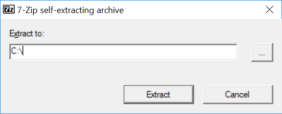

# Инструменты для разработки

Примеры и задания этой главы вы можете запускать на любой современной операционной системе: Windows, MacOS или Linux. Инструменты для разработки на Bash доступны под каждую из них. Для программирования на этом языке нам понадобится всего две вещи: его [**интерпретатор**](https://ru.wikipedia.org/wiki/%D0%98%D0%BD%D1%82%D0%B5%D1%80%D0%BF%D1%80%D0%B5%D1%82%D0%B0%D1%82%D0%BE%D1%80) и [редактор исходного кода](https://ru.wikipedia.org/wiki/%D0%A0%D0%B5%D0%B4%D0%B0%D0%BA%D1%82%D0%BE%D1%80_%D0%B8%D1%81%D1%85%D0%BE%D0%B4%D0%BD%D0%BE%D0%B3%D0%BE_%D0%BA%D0%BE%D0%B4%D0%B0). Рассмотрим их подробнее.

## Интерпретатор Bash

Мы разобрались, что такое интерпетатор. Теперь установим интерпретатор Bash на ваш компьютер. Это приложение входит в набор инструментов [**MinGW**](https://nuwen.net/mingw.html). Он включает в себя пользовательские компоненты GNU и [свободный набор компиляторов GCC](https://ru.wikipedia.org/wiki/GNU_Compiler_Collection).

Чтобы установить MinGW на свой компьютер, выполните следующие действия:

1. Скачайте самораспаковывающийся архив с набором инструментов. Это должен быть файл с именем `mingw-16.1.exe`. Число 16.1 в имени файла означает номер актуальной версии.

2. Запустите скачанный архив. Откроется диалог распаковки, как на иллюстрации 1-1.

_**Иллюстрация 1-1.** Диалог распаковки MinGW_

3. В диалоге выберите путь установки и нажмите кнопку "Extract" (извлечь). Откроется диалог с текущим состоянием распаковки файлов MinGW, как на иллюстрации 1-2.

_**Иллюстрация 1-2.** Процесс установки MinGW_

После завершения процесса установки диалог закроется автоматически. По указанному вами пути будут находится файлы MinGW.

Если вы используете Linux или MacOS, Bash уже установлен на вашу систему.

По умолчанию набор инструментов MinGW устанавливается в каталог `C:\MinGW`. Чтобы запустить Bash, перейдите в каталог `C:\MinGW\git` и запустите приложение `git-bash.exe`. Откроется окно интерпретатора командной строки Bash как на иллюстрации 1-3.

_**Иллюстрация 1-3.** Окно интерпретатора командной строки Bash_

Чтобы открыть окно интерпретатора Bash под Linux, достаточно нажать комбинацию клавиш Ctrl+Alt+T.

Для запуска Bash под MacOS выполните следующие действия:

1. Запустите программу поиска Spotlight. Для этого нажмите на иконку лупы в правом верхнем углу экрана.

2. В открывшемся окне диалоге введите текст "Terminal".

3. В открывшемся списке приложений щелкните на первой строчке с именем "Terminal".

## Редактор исходного кода

Для написания Bash скриптов подойдёт любой текстовый редактор. Вы даже можете воспользоваться стандартным приложением Windows под названием [Notepad](https://ru.wikipedia.org/wiki/%D0%91%D0%BB%D0%BE%D0%BA%D0%BD%D0%BE%D1%82_%28%D0%BF%D1%80%D0%BE%D0%B3%D1%80%D0%B0%D0%BC%D0%BC%D0%B0%29) (Блокнот). Но в нём отсутствуют какие-либо возмжности [редактора исходного кода](https://ru.wikipedia.org/wiki/%D0%A0%D0%B5%D0%B4%D0%B0%D0%BA%D1%82%D0%BE%D1%80_%D0%B8%D1%81%D1%85%D0%BE%D0%B4%D0%BD%D0%BE%D0%B3%D0%BE_%D0%BA%D0%BE%D0%B4%D0%B0).

Намного лучше будет воспользоваться приложением, разработанным специально для написания исходного кода программ. Предлагаю рассмотреть три популярных редактора исходного кода.

[**Notepad++**](https://ru.wikipedia.org/wiki/Notepad%2B%2B#cite_note-8) - это быстрый и минималистичный свободный редактор с открытм исходным кодом. Он разрабатывается запуска на ОС Windows. Поэтому если вы используете MacOS или Linux, он вам не подойдёт. Его последнюю версию можно скачать на [офицальном сайте](https://notepad-plus-plus.org/downloads/).

[**Sublime Text**](https://ru.wikipedia.org/wiki/Sublime_Text#cite_note-Features-4) проприетарный [**кросс-платформенный**](https://ru.wikipedia.org/wiki/%D0%9A%D1%80%D0%BE%D1%81%D1%81%D0%BF%D0%BB%D0%B0%D1%82%D1%84%D0%BE%D1%80%D0%BC%D0%B5%D0%BD%D0%BD%D0%BE%D1%81%D1%82%D1%8C) текстовый редактор. Кросс-платформенность означает, что программа может запускаться более чем на одной ОС или [**аппаратной платформе**](https://ru.wikipedia.org/wiki/%D0%90%D0%BF%D0%BF%D0%B0%D1%80%D0%B0%D1%82%D0%BD%D0%B0%D1%8F_%D0%BF%D0%BB%D0%B0%D1%82%D1%84%D0%BE%D1%80%D0%BC%D0%B0_%D0%BA%D0%BE%D0%BC%D0%BF%D1%8C%D1%8E%D1%82%D0%B5%D1%80%D0%B0). Вы можете использовать Sublime Text бесплатно, но в этому случае будет регулярно выводится диалоговое окно с предложением купить лицензию. Скачать редактор можно на [офицальном сайте](https://www.sublimetext.com/).

[*Visual Studio Code*](https://ru.wikipedia.org/wiki/Visual_Studio_Code) - свободный кросс-платформенный редактор от компании Microsoft с открытым исходным кодом. Доступен для скачивания на [офицальном сайте](https://code.visualstudio.com/).

Все перечисленные редакторы имеют следующие полезные для нас возможности:
* [Подсветка синтаксиса](https://ru.wikipedia.org/wiki/%D0%9F%D0%BE%D0%B4%D1%81%D0%B2%D0%B5%D1%82%D0%BA%D0%B0_%D1%81%D0%B8%D0%BD%D1%82%D0%B0%D0%BA%D1%81%D0%B8%D1%81%D0%B0).
* [Автодополнение](https://ru.wikipedia.org/wiki/%D0%90%D0%B2%D1%82%D0%BE%D0%B4%D0%BE%D0%BF%D0%BE%D0%BB%D0%BD%D0%B5%D0%BD%D0%B8%D0%B5)
* Поддержка и конвертирование широко распространённых кодировок.

Редактировать исходный код можно и без этих возможностей. Но они значительно ускоряют работу и облегчают поиск ошибок в программе.